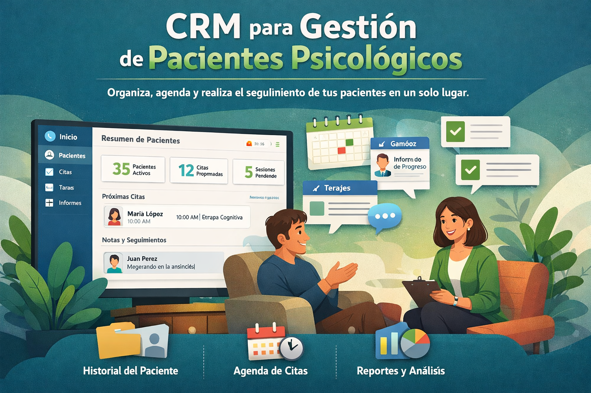

<p align="center">
  
</p>

# 🧠 Psychology Project

Welcome to **Psychology Project**, a modern web application designed to connect psychological insights with digital accessibility.  

This platform can be used as a tool for therapists, a mental health resource, or a research support system.

---

# ✨ Features

✅ **Modern Interface**  
Built with **Next.js**, **React**, and **Tailwind CSS** for a clean and calming user experience.

⚡ **Optimized Performance**  
Fast rendering using the **Next.js App Router** architecture.

📱 **Responsive Design**  
Fully adaptable for **mobile, tablet, and desktop** devices.

🔤 **Modern Typography**  
Uses **Geist font family** for improved readability and modern aesthetics.

---

# 🛠 Tech Stack

- Next.js
- React
- Tailwind CSS
- TypeScript
- Geist Font

---

# 🚀 Getting Started

Follow these steps to run the project locally.

## 📋 Prerequisites

Make sure you have installed:

- Node.js
- npm / yarn / pnpm / bun

---

# 📦 Installation

Clone the repository:

```bash
git clone https://github.com/yourusername/psychology-project.git
```

Go to the project directory:

```bash
cd psychology-project
```

Install dependencies:

```bash
npm install
```

---

# ▶ Running the Project

Start the development server:

```bash
npm run dev
```

Then open:

```
http://localhost:3000
```

in your browser.

---

# 📁 Project Structure

```
psychology-project
│
├── app
├── components
├── public
├── assets
│   └── image-psychologist-project.png
├── styles
└── README.md
```

---

# 🌍 Future Improvements

- Patient management system
- Appointment scheduling
- Therapist dashboard
- AI-assisted psychological insights

---

# 📄 License

This project is open-source and available under the **MIT License**.

---

# 👨‍💻 Author

Developed by **Johann Sebastian Velez Salamanca**

Software Developer | AI & Web Development